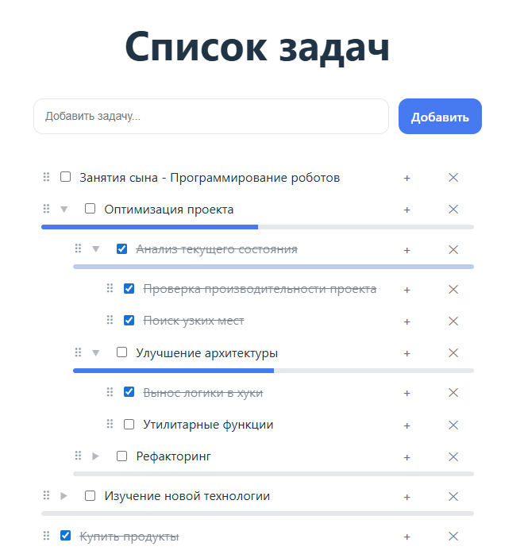
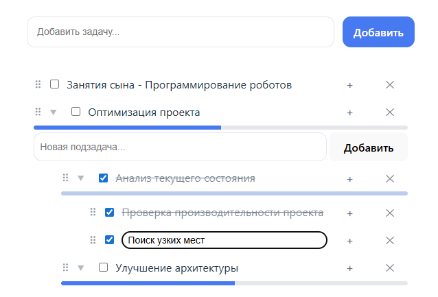

# ✅ Nested Todo / Checklist App

Современное чек-лист приложение с поддержкой **вложенных задач**, **автоматического прогресса** и **Drag & Drop**.

Демонстрация - https://nataliyayadykina.github.io/nested-todo-react/



## 🚀 Возможности

- 📋 Создание задач и подзадач (неограниченная вложенность)
- ✅ Автоматическое управление статусом выполнения
  - выполнение задачи при завершении всех подзадач
  - снятие статуса родительской задачи при снятии статуса дочерних задач или при добавлении новой подзадачи

- 📊 Прогресс выполнения для задач с подзадачами
- ✏️ Редактирование текста задач
- 🗑 Удаление задач и подзадач
- ↕️ Drag & Drop
  - перенос задач в другие задачи
  - перенос задач в корень списка

- 💾 Сохранение состояния в `localStorage`
- 🧠 Чистая архитектура с выносом логики в хуки и утилиты



## 🧩 Технологии

- **React**
- **Vite**
- **CSS Modules**
- **@dnd-kit/core** — Drag & Drop
- **LocalStorage** — хранение данных
- **Hooks + Functional Components**

## 🗂 Архитектура проекта

```
src/
├── App.jsx
│
├── components/
│   ├── TodoInput/
│   ├── TodoList/
│   └── TodoItem/
│
├── hooks/
│   └── useTodos.js
│
├── utils/
│   ├── demoTodos.js
│   ├── storage.js
│   ├── todoProgress.js
│   └── todoTree.js
│
├── index.css
└── main.jsx
```

### Ключевые идеи архитектуры

- **`useTodos`** — единая точка управления состоянием задач
- **`demoTodos`** — демонстрационные данные задач
- **`todoProgress`** — функции для работы с прогрессом выполнения задач
- **`todoTree`** — чистые рекурсивные функции для работы с деревом задач
- UI-компоненты **не знают о структуре данных**, получают готовые методы

## 🧠 Работа с вложенными задачами

Задачи хранятся в виде дерева:

```js
{
  id,
  text,
  completed,
  subtasks: []
}
```

Все операции (поиск, удаление, перенос, обновление статуса) реализованы **рекурсивно**.

Примеры:

- `removeById` — удаление задачи из дерева
- `insertAsChild` — вставка задачи в подзадачи
- `updateCompletionTree` — пересчёт статусов задач
- `setCompletedDeep` — массовое переключение поддерева

## 📦 Установка и запуск

```bash
git clone https://github.com/NataliyaYadykina/nested-todo-app-react.git
cd nested-todo-app-react
npm install
npm run dev
```

Приложение будет доступно по адресу:
👉 `http://localhost:5173`

## 🔮 Возможные улучшения

- Сохранение свернутого/развернутого состояния задач
- Добавление категорий задач
- Фильтрация задач
- Поиск
- Статистика задач
- Подробное описание задач
- Сроки выполнения задач
- Drag & Drop сортировка внутри одного уровня
- Анимация Drag & Drop
- Синхронизация с backend
- Многопользовательский режим приложения
